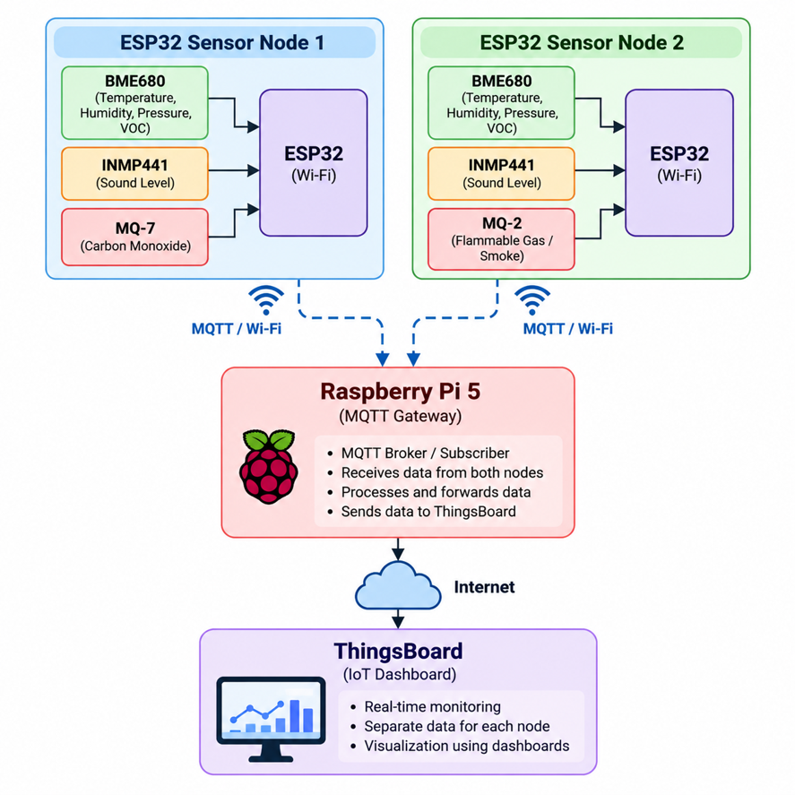
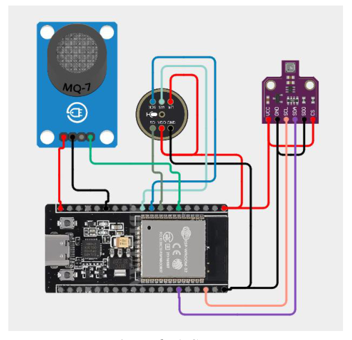
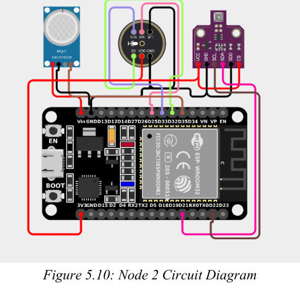

<div align="center">

# 🌐 IoT-Based Multi-Node Noise & Air Quality Monitoring


<br>


</div>

---

## 📌 Project Overview

**IoT-Based Multi-Node Noise and Air Quality Monitoring System** is an IoT project designed to collect environmental and air-quality data from multiple sensing nodes and transmit the readings through a **Raspberry Pi 5 MQTT gateway** for remote monitoring.

The system uses two **ESP32 sensor nodes**, with each node measuring environmental conditions, gas-related parameters, and sound levels. The collected readings are transmitted using **MQTT** and forwarded by the Raspberry Pi gateway to **Ubidots** for monitoring.

> **Project focus:** data collection, MQTT communication, gateway forwarding, and remote monitoring.

---

## 🏗️ System Architecture

The architecture diagram below is taken from **Figure 5.1** in the project report (PDF page 38). It shows the two ESP32 sensor nodes, Raspberry Pi 5 gateway, and Ubidots monitoring platform.




---

## 🔩 Hardware

### Node 1

| Component | Purpose |
|---|---|
| ESP32 DevKit | Sensor node controller |
| BME680 | Temperature, humidity, pressure and gas resistance |
| MQ7 | CO-related sensing |
| INMP441 | Digital I2S sound measurement |

### Node 2

| Component | Purpose |
|---|---|
| ESP32 DevKit | Sensor node controller |
| BME680 | Temperature, humidity, pressure and gas resistance |
| MQ2 | Flammable-gas sensing |
| INMP441 | Digital I2S sound measurement |

### Gateway

| Component | Purpose |
|---|---|
| Raspberry Pi 5 | MQTT gateway and data forwarder |

---

## 📡 Communication Flow

The end-to-end data flow is illustrated in the system architecture image above. Each ESP32 publishes telemetry over MQTT; the Raspberry Pi 5 receives the messages and forwards valid data to Ubidots.


The Raspberry Pi subscribes to:

```text
esp32/+/sensors
```

This allows the gateway to receive sensor messages from multiple ESP32 nodes using a common MQTT topic structure.

---

## 📊 Sensor Parameters

| Parameter | Node 1 field | Node 2 field |
|---|---|---|
| Temperature | `temp1` | `temp2` |
| Humidity | `hum1` | `hum2` |
| Pressure | `pressure1` | `pressure2` |
| Gas resistance | `gas1` | `gas2` |
| Sound level | `dB1` | `dB2` |
| Altitude | `altitude1` | `altitude2` |
| Gas sensor estimate | `co1` | `flammableGas2` |
| VOC estimate | `voc1` | `voc2` |


---

## 📨 MQTT Data Format

### Node 1 Example

```json
{
  "device_id": "ESP32_01",
  "temp1": 31.48,
  "hum1": 78.05,
  "pressure1": 1006.66,
  "gas1": 67.04,
  "dB1": 61.31,
  "altitude1": 101.85,
  "co1": 2.55,
  "voc1": 1.49
}
```

### Node 2 Example

```json
{
  "device_id": "ESP32_02",
  "temp2": 31.43,
  "hum2": 78.78,
  "pressure2": 1006.70,
  "gas2": 94.13,
  "dB2": 71.89,
  "altitude2": 101.60,
  "flammableGas2": 158.03,
  "voc2": 1.31
}
```

---

## 💻 Software Stack

<div align="center">

| Technology | Role |
|---|---|
| **Arduino IDE** | ESP32 firmware development |
| **C/C++** | ESP32 programming |
| **Python** | Raspberry Pi gateway |
| **MQTT** | Node-to-gateway communication |
| **PubSubClient** | MQTT on ESP32 |
| **Paho MQTT** | MQTT on Raspberry Pi |
| **Adafruit BME680** | BME680 interface |
| **Ubidots** | Remote monitoring |

</div>

---

## 📁 Repository Structure

- `FinalcodeNode1.ino` — ESP32 Node 1 firmware
- `FinalcodeNode2.ino` — ESP32 Node 2 firmware
- `Script.py` — Raspberry Pi MQTT gateway and forwarding script
- `README.md` — Project documentation
- `assets/` — Diagrams extracted from the project report


---

## ⚙️ Node 1 Connections

The Node 1 circuit diagram is taken from **Figure 5.9** in the attached project report.



## ⚙️ Node 2 Connections

The Node 2 circuit diagram is taken from **Figure 5.10** in the attached project report.



---

## 🚀 Getting Started

### 1. Clone the repository

```bash
git clone https://github.com/Vedang9698/iot-air-noise-quality-monitoring.git
cd iot-air-noise-quality-monitoring
```

### 2. Configure the ESP32 firmware

Open:

```text
FinalcodeNode1.ino
FinalcodeNode2.ino
```

Configure the required Wi-Fi and MQTT/Ubidots settings.

**Do not commit passwords, tokens, API keys, or other credentials to GitHub.**

### 3. Upload the firmware

Open each `.ino` file in **Arduino IDE**, select the appropriate ESP32 board and port, then upload the firmware.

### 4. Configure the Raspberry Pi

Copy:

```text
Script.py
```

to the Raspberry Pi and install the required Python MQTT library.

```bash
pip install paho-mqtt
```

### 5. Run the gateway

```bash
python3 Script.py
```

The Raspberry Pi will subscribe to the ESP32 MQTT sensor topic and forward the received data for remote monitoring.

---

## 🎯 Project Objectives

- Develop a multi-node IoT monitoring system.
- Collect environmental parameters from multiple locations/nodes.
- Monitor noise levels using INMP441 microphones.
- Monitor gas-related parameters using MQ-series sensors and BME680.
- Establish MQTT-based communication between ESP32 nodes and a Raspberry Pi.
- Use Raspberry Pi as a central MQTT gateway.
- Forward sensor data to a remote monitoring platform.
- Provide a scalable architecture that can support additional sensor nodes.

---

## 🔬 Calibration & Data Interpretation

The system uses practical calibration and conversion methods for the connected sensors.

The BME680 provides gas resistance that can be used to derive an estimated VOC-related metric. MQ7 and MQ2 readings are also treated as approximate monitoring values.

The sound sensor is calibrated against a reference sound-level measurement.

> **Note:** These sensor-derived gas/VOC values are intended for project-level monitoring and demonstration. They should not be interpreted as laboratory-certified gas concentrations or safety measurements.

---

## ⚠️ Limitations

- MQ-series sensors require proper calibration and warm-up for reliable measurements.
- Gas concentration values are approximate.
- BME680 gas resistance is not a direct laboratory VOC concentration measurement.
- INMP441-based sound measurements depend on calibration and environmental conditions.
- Wi-Fi connectivity affects real-time data transmission.
- Ubidots availability depends on network connectivity and account configuration.

---

## 🔮 Future Scope

Potential improvements include:

- Adding more ESP32 sensor nodes.
- Adding particulate-matter sensors.
- Improved sensor calibration.
- Local buffering during network outages.
- Historical data analysis.
- Automated alerts for abnormal readings.
- Machine-learning-based environmental analysis.
- Mobile/web visualization improvements.
- Geographic mapping of sensor readings.

---

## 👨‍💻 Project

**IoT-Based Multi-Node Noise and Air Quality Monitoring System**

Developed as an academic IoT project.

### Repository

[GitHub Repository](https://github.com/Vedang9698/iot-air-noise-quality-monitoring)

---

<div align="center">

### 🌱 Monitor. Measure. Understand.


</div>
